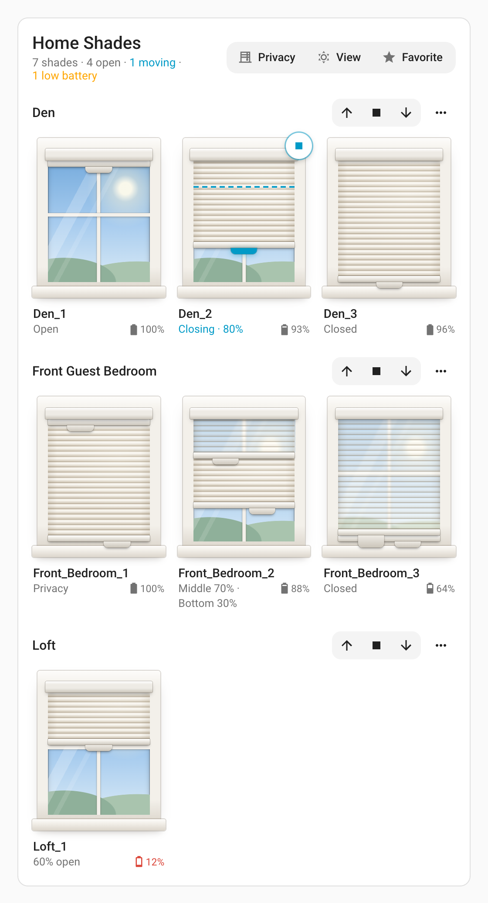

# Dashboard card

The integration ships a Lovelace card, **Norman Shades**, that draws every blind as a window
with its shade hanging in it, grouped by room. The window is the control: **drag a rail's pull
tab** to move it.



*The card with seven blinds across three rooms. Den_2 is on its way down: the shade is drawn
where it is going, the dashed line is where it is now, and its Stop button sits on the corner.
The two-rail blinds in the middle row show Best privacy (the blackout across the window), both
rails part-way, and both rails down (the light-filtering fabric across the window, with the view
showing through it).*

The card header is named after your **hub** — the name it has in Home Assistant, which the
integration takes from the Norman app — so two hubs give two distinguishable cards. Set `title`
to override it, or `title: ""` for no heading text at all. Under the name, a summary line counts
the shades, how many are open, any that are moving, and any low batteries.

If your card was added before v0.30 it may already have `title: Shades` saved in its config —
the card picker used to supply that automatically. Remove the `title` line to get the hub name.

[`examples/dashboard.yaml`](../examples/dashboard.yaml) is a minimal dashboard built on this
card. Paste its view into your dashboard's raw configuration editor.

## Adding it

The integration serves the card and registers it as a dashboard resource on its own, so there
is nothing to install. After setting up the integration (and one Home Assistant restart, if you
had just installed the integration itself):

1. Open the dashboard you want it on and enter edit mode.
2. **Add card**, then search for **Norman Shades**.
3. Save. There is nothing to configure; the card finds your blinds by itself.

In **YAML mode** dashboards the resource list is not writable by an integration, so add it
once under your `resources:` as a JavaScript module — the log line at startup names the exact
URL, which is `/norman/norman-shades-card.js?v=<integration version>`.

## What it shows

Blinds are grouped by their Home Assistant **area**, which the integration seeds from the
hub's own room names, so the grouping matches the Norman app out of the box. Moving a blind to
a different area in Home Assistant moves it on the card. Each room's blinds sit in a grid that
fits as many windows across as the card has room for.

| Element | Notes |
|---|---|
| Room heading | The area name, with **▲ ■ ▼** for the whole room and **⋯** for the room's presets. Blinds with no area are grouped under "Unassigned". |
| The window | The blind, drawn where the hub says each rail is. **Drag a pull tab** to move that rail; the percentage shows above it as you drag, in steps of 10, and the position is sent when you let go. |
| Blind name | Click it to open the usual more-info dialog. |
| Battery | Beside the status: the battery icon, filled to the level, and the percentage. Amber at 30% and below, red at 15% and below. |
| Status | "Open", "Closed", "40% open"; on a two-rail blind "Privacy" for the app's preset, or both rails, e.g. "Middle 70% · Bottom 30%". |
| While moving | The shade is drawn where it is **going**, a dashed line marks where the rail actually **is**, the status reads "Closing · 70%", and a **■ Stop** button appears on the window's corner until it arrives. |

A blind the hub has stopped reporting is greyed out, reads "Unavailable", and cannot be dragged.

### Moving a blind

- **Mouse:** press anywhere on the window and the nearest rail follows the pointer. Where a
  two-rail blind's rails are together, press on the side of the tab you want.
- **Touch:** start on a rail — the pull tab, or anywhere across the width of the rail. A swipe
  that starts elsewhere on the window scrolls the page instead, so scrolling past a row of
  windows cannot move a blind.
- **Keyboard:** Tab to a rail, then ↑ / ↓ (10%), Page Up / Page Down (30%), Home (closed) and
  End (open). The position is sent once you stop pressing keys, because the hub drops commands
  that arrive closer together than about 1.6 seconds.

A press that does not move sends nothing, so a mis-tap cannot move a blind. The drag follows
your finger's movement rather than jumping to where you pressed.

After you let go, the shade stays where you put it while the hub takes the command up. If the
hub has not reported that position as its target within 15 seconds, the window goes back to
what the hub reports, so a command the hub dropped is visible rather than hidden.

### Two-rail blinds

On a **two-rail** blind the window shows both fabrics, arranged the way the blind is: the
**light-filtering** fabric hangs from the headrail down to the **middle rail**, drawn
see-through so the view shows through it — bright by day, dark at night — and the **blackout**
hangs from the middle rail down to the **bottom rail**, drawn in the same ivory cloth as a
single-rail shade.

That is why the app's presets look the way they do:

| Preset | Rails | The window shows |
|---|---|---|
| **Best view** | both 100 | A clear window — both rails tucked under the headrail. |
| **Best privacy** | bottom 0, middle 100 | The **blackout** across the whole window, the light-filtering fabric stacked away. |
| Both down | both 0 | The **light-filtering** fabric across the whole window, the blackout stacked on the sill. |

Each rail has its own pull tab, and either one can be moved at any time: the **left** tab is the
middle rail, the **right** tab the bottom rail. They sit apart so that both can still be reached
when the rails are together — fully open, both down, or anywhere between. The middle rail always
hangs above the bottom rail, so a rail taken past the other carries it along, as it does on the
blind: pull the middle rail down from fully open and the bottom rail comes down with it; push
the bottom rail up past the middle rail and the middle rail goes up. The card sends one command
for the rail you moved, and the integration moves the other rail in the same command.

On a top-down/bottom-up blind the same two bands read as the open top and the covered bottom.

### The view

The window's view follows the sun (`sun.sun`): blue sky by day, a warm low sun near sunrise and
sunset, dusk, and a night sky with a moon. On a dark theme the window's trim darkens with the
card. The picture is drawn entirely in CSS — no images — so it follows your theme, stays sharp
on any screen, and scales with the card.

### List layout

For a compact card with a slider per rail instead of the windows:

```yaml
type: custom:norman-shades-card
hide_picture: true
```

The sliders drive the integration's `number` entities, so they move in the same 10% steps as
those entities and never disagree with the covers.

### Whole-room control

Each room heading carries **▲ ■ ▼** of its own, acting on every blind in that room at once —
including the middle rails of two-rail blinds, so "close the bedroom" puts both rails down. It
is one service call per press, not one per blind.

This is on by default. For plain headings:

```yaml
type: custom:norman-shades-card
hide_room_controls: true
```

The buttons live in the heading, so `hide_room_names: true` removes them too — there is
nowhere left to put them, and the rooms run together as one grid.

These buttons fan out over Home Assistant's cover entities, so **close** puts *both* rails of a
two-rail blind down, which leaves the light-filtering fabric across the window. That is not the
same as the Norman app's **Best Privacy**, which raises the middle rail fully and lowers the
bottom rail — the blackout across the window.

### The app's room buttons

The **⋯** at the end of each room heading folds out the app's own three for that room. To
remove it:

```yaml
type: custom:norman-shades-card
hide_room_presets: true
```

| Button | Does |
|---|---|
| **Privacy** (Best privacy) | Bottom rail to 0, middle rail to 100 |
| **View** (Best view) | Both rails to 100 |
| **Favorite** | The room's stored favorite position |

These send the hub's own room verbs through the
[`norman.room_command`](services.md#normanroom_command) action — one request for the room, not
one per blind — so they behave exactly as the app does. Favorite has no Home Assistant
equivalent and is only reachable this way. Each button flashes when pressed, since the blinds
take a while to answer.

### The whole house

The same three buttons sit in the card's own header, where they move **every** blind on the
hub. On a narrow card they shrink to their icons. To leave the header plain:

```yaml
type: custom:norman-shades-card
hide_home_controls: true
```

| Button | Does |
|---|---|
| Best privacy | Every blind: bottom rail to 0, middle rail to 100 |
| Best view | Every blind: both rails to 100 |
| Favorite | Every blind to its own stored favorite |

Like the room presets these go through `norman.room_command`, but with no room at all — the hub
treats a command with no scope as "everything", so it is one request for the house however many
blinds you have. These are the same three buttons the app's own **All Rooms** screen sends.
Because they are the hub's own verbs this is not a fan-out and needs no room-name match.

They deliberately carry the app's names rather than open/close arrows. **Best privacy** is not a
close: it raises the middle rail fully, so a two-rail blind ends with the blackout across the
window rather than the light-filtering fabric.

All three work on single-rail blinds as well as two-rail ones — a capture of the app driving a
single-rail shade shows it sending the same three verbs unchanged.

There is no house-wide **stop**: the hub's stop is per blind, so it would have to fan out over
every cover, and a stop that lags the blinds it is stopping is worse than none. Use a room's
stop, or the **■ Stop** on a moving blind, instead.

The room presets match on the **hub's** room name while the card groups by Home Assistant
**area**. The integration seeds areas from the hub's room names, so they agree out of the box; if
you rename an area, the preset buttons for it will report that the room is unknown, and name the
ones the hub does know. The house buttons carry no room at all, so nothing there can mismatch.

## Options

Every option is optional; the card works with none of them.

```yaml
type: custom:norman-shades-card
title: Norman Hub          # omit to use the hub's own name
hide_picture: false        # list layout: a slider per rail instead of the windows
hide_battery: false        # hide the battery readings
hide_room_names: false     # one grid instead of room headings
hide_room_controls: false  # remove the open/stop/close from each room heading
hide_room_presets: false   # remove each room's ⋯ presets
hide_home_controls: false  # remove the whole-house presets from the header
rooms:                     # only these areas, in this order
  - Master Bedroom
  - Den
default_room: Unassigned   # heading for blinds with no area
bottom_label: Bottom rail  # rename the rails (the status line uses the first word)
middle_label: Middle rail
```

`title` and the `hide_*` options are also available in the card's visual editor.

## Using the built-in cards instead

The card is a convenience, not a requirement — everything it does is available from Home
Assistant's own cards, since the integration exposes plain covers, numbers, buttons, and
sensors. A tile card with a position feature gives one blind a slider:

```yaml
type: tile
entity: cover.living_drape_bottom_rail
features:
  - type: cover-open-close
  - type: cover-position
```

And the rail sliders are ordinary `number` entities, so they work in any card that takes one:

```yaml
type: entities
entities:
  - number.living_drape_bottom_rail_position
  - number.living_drape_middle_rail_position
  - sensor.living_drape_battery
```

## Checking which version you are running

The card takes its version from the URL the integration registers it at, so it always reports
the build the browser actually loaded rather than a number compiled into the file. On load it
prints one line to the browser console (⌥⌘I, or F12, then Console):

```
 NORMAN-SHADES-CARD  v0.19
```

That should match the **Version** shown on the Norman entry under **Settings → Devices &
services**. If it is lower, the browser is running a cached copy — hard-refresh the page. If
it says `unknown`, the resource was added by hand without the `?v=` stamp; the card still
works, but it can no longer be cache-busted on upgrade, so re-register it with the stamp.

A [diagnostics download](../README.md#diagnostics) reports the same comparison under
`frontend`, as `integration_version`, `registered_versions`, and a `version_matches` flag —
useful when attaching to an issue, since it does not depend on the reporter's browser.

## Troubleshooting

**The card is not in the "Add card" list.** Hard-refresh the browser (⇧ and reload) — the
resource is registered at startup, and a tab open from before will not have it. If it is still
missing, check the log for `Registered the Norman shades card` and look under
**Settings → Dashboards → ⋮ → Resources** for `/norman/norman-shades-card.js`.

**"Custom element doesn't exist".** The browser has an older copy cached, or two resource
entries point at the card. The integration repoints stale entries on every start, so a restart
plus a hard refresh usually clears it. A [diagnostics download](../README.md#diagnostics)
reports the version the card should be and what Lovelace actually has registered, under
`frontend`.

**A blind is missing from the card.** The card lists blinds that have a Norman cover entity
which is not hidden or disabled. Check the blind's entities on its device page.
